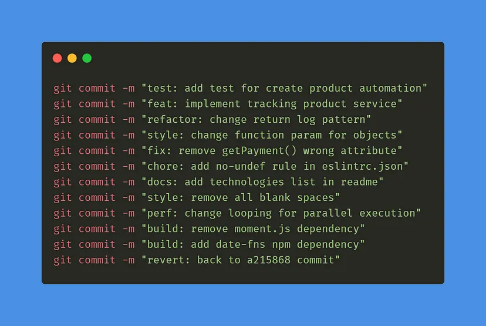

# Financinhas
Repositório dedicado à cadeira de Projeto Integrado 1 do curso de Engenharia de Software, referente ao semestre 2024.2.
Cadeira ministrada pelo professor JEFERSON KENEDY MORAIS VIEIRA, para a turma  01A, da Universidade Federal do Ceará - campus Quixadá.

## Integrantes
- Francisco Gabriel da Silva Lima - 514586
- Vitor Loula Silva - 540622
- Lorena Emanuele Pinheiro Ferreira - 516293
- Gabriel Al-Samir Guimarães Sales - 536039
- Paulo Victor Costa Ferreira - 557331

## Propósito
**Financinhas** é uma plataforma online e gamificada de educação financeira para o ambiente escolar. O objetivo principal é promover uma relação saudável com o dinheiro entre crianças e adolescentes, oferecendo conteúdo especializado e acessível a partir de uma aplicação desktop, facilitando o uso em sala de aula.

## Escopo
O **Financinhas** será uma aplicação online, acessada exclusivamente em aplicação desktop, utilizando elementos de game design para ensinar conceitos de educação financeira de forma lúdica e interativa. A plataforma inclui o quiz "Aventuras do Dinheirinho" como ferramenta de ensino e prática para ajudar os alunos a compreenderem temas financeiros básicos.

## Tecnologias
- **Electron**
- **React**
- **Styled Components**
- **Typescript**
- **Fyrebase**

## Padrões de Desenvolvimento
### Padrão de Branch
O nome das branchs criadas para implementação de toda e qualquer mudança deverá seguir o seguinte padrão:
Para _Features_: "feature/nome-da-branch-em-inglês"
para _Bugfix_: "bugfix/nome-da-brach-em-inglês"
para _refatoração_: "refactor/nome-da-branch-em-inglês"

O nome da branch deve ser o mais descritível possível, informando o que implementa ao produto.

### Padrão de commit
O padrão de commit que será utilizado será o Conventional Commits. Para mais detalhes da utilização desse padrão leia este [artigo](https://medium.com/linkapi-solutions/conventional-commits-pattern-3778d1a1e657).

Em suma, siga os padrões da imagem abaixo:

### Padrão de PRs
Todo commit deverá possuir um título bem descritível seguindo o seguinte padrão:
Para _Bugfix_: "Fixes - Título em Inglês do Card que Resolve"
para _Feature_: "Feature - Títuo em Inglês do Card que Resolve"

Ex: Feature - Adding a new prop to the Button component
    Fixes - Fixing the type in the Button component

